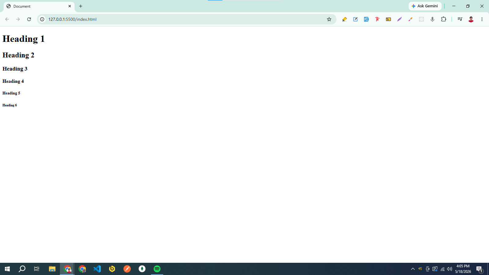

<h1 align="center">HTML Notes</h1>

- [HTML Introduction:](#html-introduction)
  - [What is HTML:](#what-is-html)
  - [A Simple HTML Document:](#a-simple-html-document)
  - [What is an HTML Element, Tag, and Attribute:](#what-is-an-html-element-tag-and-attribute)
- [HTML Headings:](#html-headings)
- [HTML Paragraph](#html-paragraph)
  - [HTML Paragraph](#html-paragraph-1)
  - [HTML Line Breaks](#html-line-breaks)
- [HTML Text Formatting](#html-text-formatting)
- [HTML Comments](#html-comments)
- [HTML Links](#html-links)
  - [The Target Attribute](#the-target-attribute)
  - [Image as a Link](#image-as-a-link)
  - [Email Address as a Link](#email-address-as-a-link)
  - [Anchor Tag with Download Attribute](#anchor-tag-with-download-attribute)
- [HTML Images](#html-images)
- [HTML File Path](#html-file-path)
- [HTML Favicon](#html-favicon)
- [HTML Page Title](#html-page-title)
- [HTML Tables](#html-tables)
  - [Define an HTML Table](#define-an-html-table)
- [HTML Lists](#html-lists)
  - [Unordered List](#unordered-list)
  - [Ordered List](#ordered-list)
- [HTML Block and Inline Elements](#html-block-and-inline-elements)
  - [Block Elements](#block-elements)
  - [Inline Elements](#inline-elements)
  - [Div Element](#div-element)
  - [Span Element](#span-element)
- [HTML class Attribute](#html-class-attribute)
- [HTML id Attribute](#html-id-attribute)
- [HTML Iframe](#html-iframe)
- [HTML Semantic Elements](#html-semantic-elements)
- [HTML Forms](#html-forms)
  - [HTML Form Elements](#html-form-elements)
  - [HTML Input Types](#html-input-types)
  - [HTML Input Attributes](#html-input-attributes)
- [HTML Video](#html-video)
  - [The HTML `<video>` Element](#the-html-video-element)
  - [Autoplay Attribute](#autoplay-attribute)
- [HTML Audio](#html-audio)
  - [The HTML `<audio>` Element](#the-html-audio-element)
  - [Autoplay Attribute](#autoplay-attribute-1)
- [HTML YouTube Videos](#html-youtube-videos)
  - [Playing a YouTube Video in HTML](#playing-a-youtube-video-in-html)
  - [YouTube Autoplay + Mute](#youtube-autoplay--mute)
  - [YouTube Loop](#youtube-loop)

# HTML Introduction:

## What is HTML:
HTML(Hyper Text Markup Language) is the standard markup language for creating web pages. Its element tells the browser how to display the content.

**Note:** 
- Hyper Text = Hyper Text is text with clickable links that take you to other pages or different parts of the same page.
- Markup Language = Markup Language is a way to write text using special tags and rules that tell a browser how to organize and display the content.

## A Simple HTML Document:

```html
<!DOCTYPE html>
<html lang="en">

<head>
    <meta charset="UTF-8">
    <meta name="viewport" content="width=device-width, initial-scale=1.0">
    <!-- 
      <meta name="description" content="This is a simple HTML document">
     <meta name="author" content="John Doe"> 
     -->
    <title>Page Title</title>
</head>

<body>

</body>

</html>
```

**here**:
- The `<!DOCTYPE html>` declaration defines that this document is an HTML5 document
- The `<html>` element is the root element of an HTML page and the lang attribute defines the language of the page.
  - Root Element = The root element is the topmost element in a document that contains all the other elements. The `<html>` element is the root element because it wraps all the content of the page, including the `<head>` and `<body>` sections
- The `<head>` element in HTML is a container for metadata and links to external resources related to the webpage.
  - Meta information = Meta information is data about the HTML page that isn’t directly visible to users but helps browsers and search engines understand the page better.
- The `<title>` element specifies a title for the HTML page which is shown the browser’s page’s tab.
- The `<body>` element defines the document’s body, and is a container for all the visible contents.


## What is an HTML Element, Tag, and Attribute: 
- Element: An HTML element is defined by a start tag, some content, and an end tag:

```html
<tagName>Content goes here</tagName>
```
Note: Some HTML elements have no content and end tag. These elements are called empty elements. 

- Tag: A tag in HTML is a piece of code enclosed in angle bracket `<>`, that are used to create elements.
- Attribute: HTML attributes provide additional information about HTML elements. Attributes are always specified in the start tag and come in name/value pairs like: `name =”value”`.

# HTML Headings:
HTML Heading are defined with the `<h1>` to `<h6>` tags. `<h1>` defines the most important and `<h6>` defines the least important heading.

```html
<!DOCTYPE html>
<html lang="en">

<head>
    <meta charset="UTF-8">
    <meta name="viewport" content="width=device-width, initial-scale=1.0">
    <title>Document</title>
</head>

<body>
    <h1>Heading 1</h1>
    <h2>Heading 2</h2>
    <h3>Heading 3</h3>
    <h4>Heading 4</h4>
    <h5>Heading 5</h5>
    <h6>Heading 6</h6>
</body>

</html>
```



# HTML Paragraph


## HTML Paragraph

## HTML Line Breaks

# HTML Text Formatting

# HTML Comments

# HTML Links

## The Target Attribute

## Image as a Link

## Email Address as a Link

## Anchor Tag with Download Attribute

# HTML Images

# HTML File Path

# HTML Favicon

# HTML Page Title

# HTML Tables

## Define an HTML Table

# HTML Lists

## Unordered List

## Ordered List

# HTML Block and Inline Elements

## Block Elements

## Inline Elements

## Div Element

## Span Element

# HTML class Attribute

# HTML id Attribute

# HTML Iframe

# HTML Semantic Elements

# HTML Forms

## HTML Form Elements

## HTML Input Types

## HTML Input Attributes

# HTML Video

## The HTML `<video>` Element

## Autoplay Attribute

# HTML Audio

## The HTML `<audio>` Element

## Autoplay Attribute

# HTML YouTube Videos

## Playing a YouTube Video in HTML

## YouTube Autoplay + Mute

## YouTube Loop