<h1 align="center">HTML Notes</h1>

- [HTML Introduction:](#html-introduction)
  - [What is HTML:](#what-is-html)
  - [A Simple HTML Document:](#a-simple-html-document)
  - [What is an HTML Element, Tag, and Attribute:](#what-is-an-html-element-tag-and-attribute)
  - [HTML Favicon:](#html-favicon)
  - [HTML Page Title:](#html-page-title)
- [HTML Headings:](#html-headings)
- [HTML Paragraph:](#html-paragraph)
  - [HTML Line Breaks](#html-line-breaks)
- [HTML Text Formatting:](#html-text-formatting)
- [HTML Comments:](#html-comments)
- [HTML Links:](#html-links)
  - [The Target Attribute:](#the-target-attribute)
  - [Anchor tag with email address:](#anchor-tag-with-email-address)
  - [Anchor Tag with Download Attribute](#anchor-tag-with-download-attribute)
- [HTML Images:](#html-images)
- [HTML Tables:](#html-tables)
- [HTML Lists:](#html-lists)
  - [Unordered List:](#unordered-list)
  - [Ordered List:](#ordered-list)
- [HTML Block and Inline Elements:](#html-block-and-inline-elements)
  - [Block Elements](#block-elements)
  - [Inline Elements](#inline-elements)
  - [Div Element:](#div-element)
  - [Span Element:](#span-element)
- [HTML Class and ID Attribute:](#html-class-and-id-attribute)
  - [HTML Class Attribute:](#html-class-attribute)
  - [HTML id Attribute:](#html-id-attribute)
  - [Difference Between class and id:](#difference-between-class-and-id)
- [HTML Semantic Elements:](#html-semantic-elements)
- [HTML Forms](#html-forms)
  - [HTML Form Elements](#html-form-elements)
  - [HTML Input Types](#html-input-types)
  - [HTML Input Attributes](#html-input-attributes)
- [HTML Video](#html-video)
  - [The HTML `<video>` Element](#the-html-video-element)
  - [Autoplay Attribute](#autoplay-attribute)
- [HTML Audio](#html-audio)
  - [The HTML `<audio>` Element](#the-html-audio-element)
  - [Autoplay Attribute](#autoplay-attribute-1)
- [HTML YouTube Videos](#html-youtube-videos)
  - [Playing a YouTube Video in HTML](#playing-a-youtube-video-in-html)
  - [YouTube Autoplay + Mute](#youtube-autoplay--mute)
  - [YouTube Loop](#youtube-loop)

# HTML Introduction:

## What is HTML:
HTML(Hyper Text Markup Language) is the standard markup language for creating web pages. Its element tells the browser how to display the content.

**Note:** 
- Hyper Text = Hyper Text is text with clickable links that take you to other pages or different parts of the same page.
- Markup Language = Markup Language is a way to write text using special tags and rules that tell a browser how to organize and display the content.

## A Simple HTML Document:

```html
<!DOCTYPE html>
<html lang="en">

<head>
    <meta charset="UTF-8">
    <meta name="viewport" content="width=device-width, initial-scale=1.0">
    <!-- 
      <meta name="description" content="This is a simple HTML document">
     <meta name="author" content="John Doe"> 
     -->
    <title>Page Title</title>
</head>

<body>

</body>

</html>
```

**here**:
- The `<!DOCTYPE html>` declaration defines that this document is an HTML5 document
- The `<html>` element is the root element of an HTML page and the lang attribute defines the language of the page.
  - Root Element = The root element is the topmost element in a document that contains all the other elements. The `<html>` element is the root element because it wraps all the content of the page, including the `<head>` and `<body>` sections
- The `<head>` element in HTML is a container for metadata and links to external resources related to the webpage.
  - Meta information = Meta information is data about the HTML page that isn’t directly visible to users but helps browsers and search engines understand the page better.
- The `<title>` element specifies a title for the HTML page which is shown the browser’s page’s tab.
- The `<body>` element defines the document’s body, and is a container for all the visible contents.


## What is an HTML Element, Tag, and Attribute: 
- Element: An HTML element is defined by a start tag, some content, and an end tag:

```html
<tagName>Content goes here</tagName>
```
Note: Some HTML elements have no content and end tag. These elements are called empty elements. 

- Tag: A tag in HTML is a piece of code enclosed in angle bracket `<>`, that are used to create elements.
- Attribute: HTML attributes provide additional information about HTML elements. Attributes are always specified in the start tag and come in name/value pairs like: `name =”value”`.

## HTML Favicon: 
A favicon is a small image displayed in the browser tab. As it is a small image, so it should be a simple image with high contrast.

```html
<!DOCTYPE html>
<html lang="en">

<head>
    <meta charset="UTF-8">
    <meta name="viewport" content="width=device-width, initial-scale=1.0">
    <title>Document</title>
    <link rel="icon" href="./assets/images/my-photo.png">

</head>

<body>

</body>

</html>
```

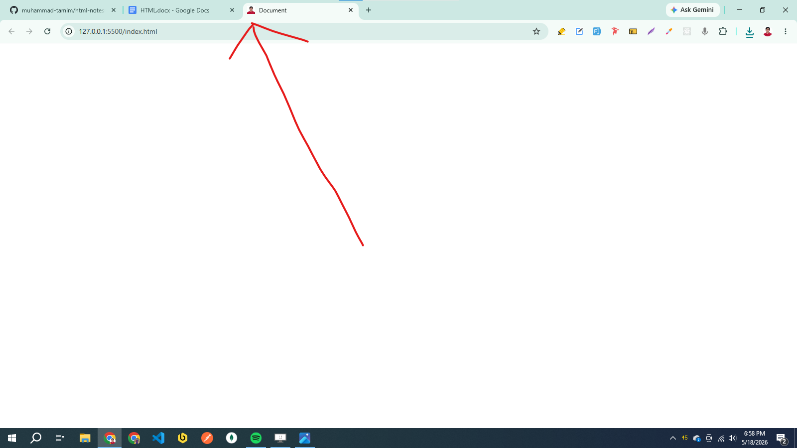

## HTML Page Title: 

The `<title>` tag adds a title to our page. The title should describe the content and the meaning of the page.

```html
<!DOCTYPE html>
<html lang="en">

<head>
    <meta charset="UTF-8">
    <meta name="viewport" content="width=device-width, initial-scale=1.0">
    <title>My Title</title>
</head>

<body>

</body>

</html>
```

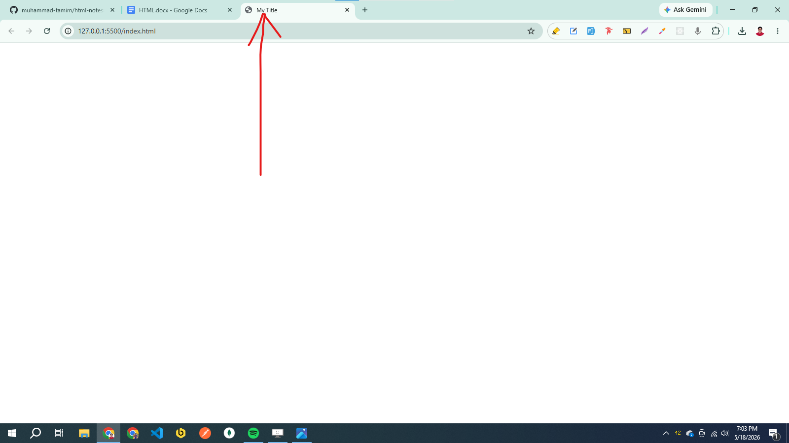


# HTML Headings:
HTML Heading are defined with the `<h1>` to `<h6>` tags. `<h1>` defines the most important and `<h6>` defines the least important heading.

```html
<!DOCTYPE html>
<html lang="en">

<head>
    <meta charset="UTF-8">
    <meta name="viewport" content="width=device-width, initial-scale=1.0">
    <title>Document</title>
</head>

<body>
    <h1>Heading 1</h1>
    <h2>Heading 2</h2>
    <h3>Heading 3</h3>
    <h4>Heading 4</h4>
    <h5>Heading 5</h5>
    <h6>Heading 6</h6>
</body>

</html>
```


# HTML Paragraph: 
The HTML `<p>` tag defines a paragraph. A paragraph always stars on a new line and ignore extra whitespace and line brakes.

```html
<!DOCTYPE html>
<html lang="en">

<head>
    <meta charset="UTF-8">
    <meta name="viewport" content="width=device-width, initial-scale=1.0">
    <title>Document</title>
</head>

<body>
    <p>
        This paragraph
        contains a lot of lines
        in the source code,
        but the browser
        ignores it.
    </p>

    <p>
        This paragraph
        contains a lot of spaces
        in the source code,
        but the browser
        ignores it.
    </p>

</body>

</html>
```

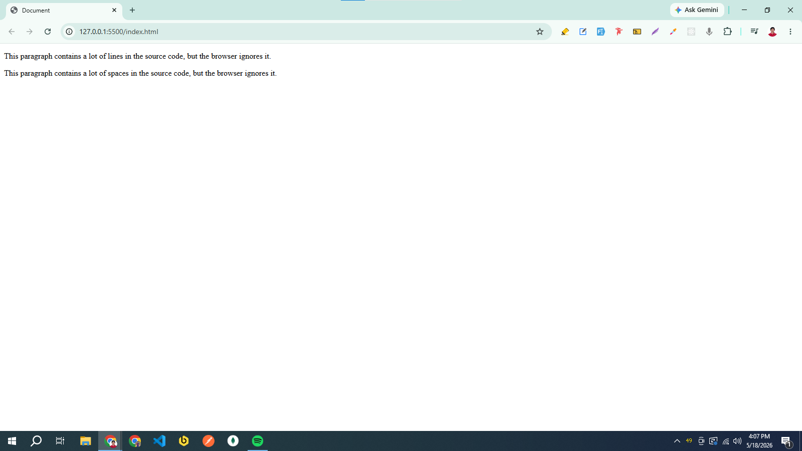

## HTML Line Breaks
The HTML `<br>` tag defines a line break. Use `<br>` tag if you want a line break without starting a new paragraph.

```html
<!DOCTYPE html>
<html lang="en">

<head>
    <meta charset="UTF-8">
    <meta name="viewport" content="width=device-width, initial-scale=1.0">
    <title>Document</title>
</head>

<body>
    <p>This is<br>a paragraph<br>with line breaks. </p>
</body>

</html>
```

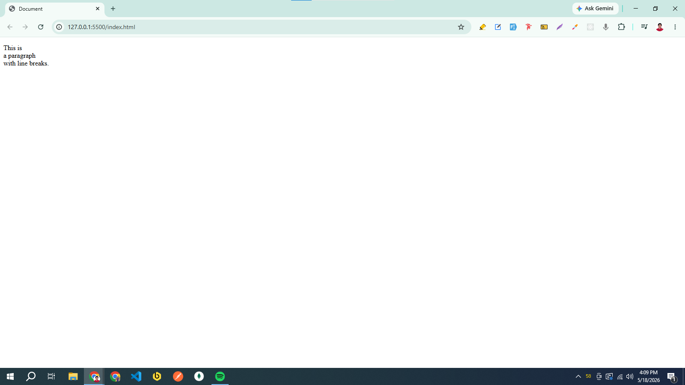

# HTML Text Formatting: 
HTML contains several tags for defining text with a special meaning.

```html
<!DOCTYPE html>
<html lang="en">

<head>
    <meta charset="UTF-8">
    <meta name="viewport" content="width=device-width, initial-scale=1.0">
    <title>Document</title>
</head>

<body>
    <p><strong>Important Text</strong></p>
    <p><small>Smaller Text</small></p>
    <p>This is a Subscript text = co<sub>2</sub></p>
    <p>This is a superscript text = sin<sup>2</sup></p>
</body>

</html>
```

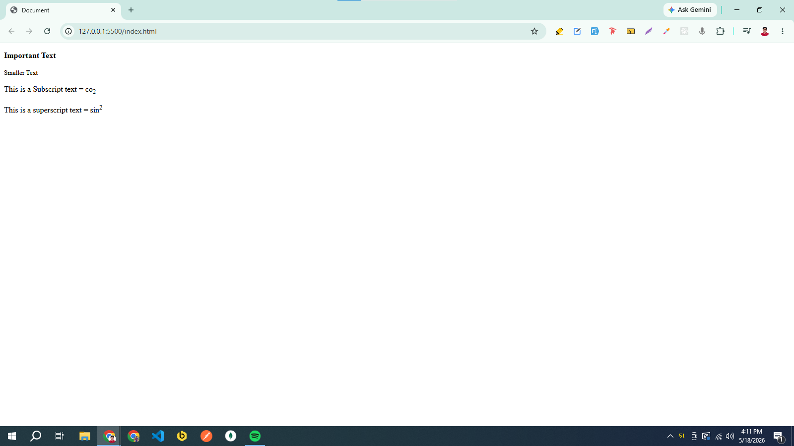

# HTML Comments:
Comments are not displayed in the browser, but they can help documentation our code.

```html
<!DOCTYPE html>
<html lang="en">

<head>
    <meta charset="UTF-8">
    <meta name="viewport" content="width=device-width, initial-scale=1.0">
    <title>Document</title>
</head>

<body>
    <!-- This is a comment -->
    <!-- This is a comment -->
    <!-- This is a comment -->
    <!-- This is a comment -->
    <!-- This is a comment -->
    <!-- This is a comment -->
    <!-- This is a comment -->
    <!-- This is a comment -->
    <!-- This is a comment -->
</body>

</html>
```

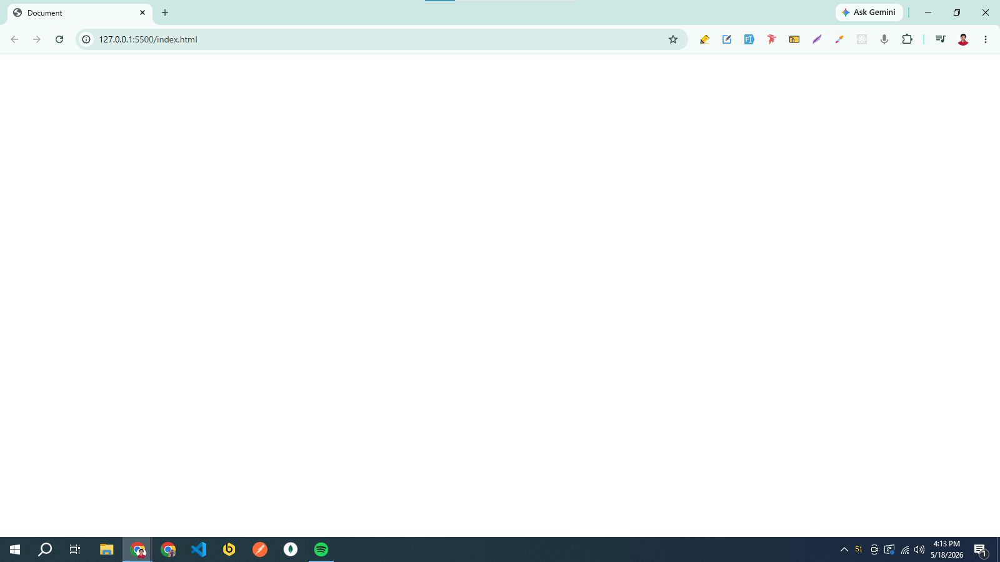

# HTML Links:
The `<a>` tag defines a link. The most important part of the `<a>` tag is the href (hypertext reference) attribute, which indicates the link’s destination.

```html
<!DOCTYPE html>
<html lang="en">

<head>
    <meta charset="UTF-8">
    <meta name="viewport" content="width=device-width, initial-scale=1.0">
    <title>Document</title>
</head>

<body>
    <a href="https://www.google.com">Google</a>
</body>

</html>
```

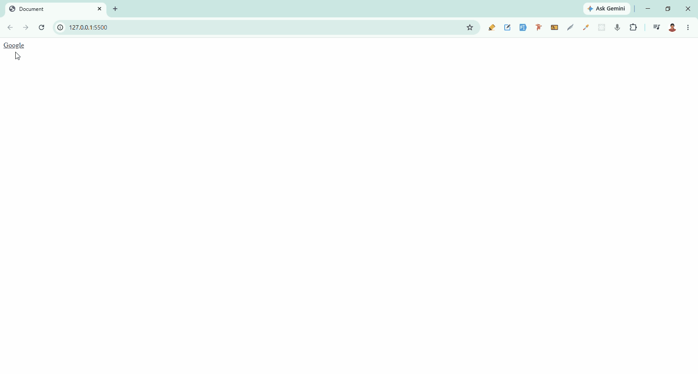

**Note:** By default, links will appear as follows in all browsers:
- An unvisited link is underlined and blue
- A Visited link is underline and purple
- An active link is underlined and red

## The Target Attribute:
By default, when we click on a link, the linked page will open in the current window. If we want to change this behavior, we can use the target attribute in the `<a>` tag to specify where the linked page should open. The target attribute can have one of the following values:
- _self = Default, open the links in the same window/tab as it was clicked. 
- _blank = Open the links in a new tab.
- _parent = Open the links in a Parent Frame.
- _top = Opens the link in the full window, breaking out of all frames.

```html
<!-- iframe1.html -->
<!-- Open this page on live server -->

<!DOCTYPE html>
<html lang="en">

<head>
    <meta charset="UTF-8">
    <meta name="viewport" content="width=device-width, initial-scale=1.0">
    <title>Iframe 1</title>
</head>

<body style="border: 5px solid red; padding: 20px;">

    <h1 style="color: red;">Main Page (iframe1.html)</h1>

    <iframe src="iframe2.html" width="700" height="500" style="border: 5px solid blue;"></iframe>

</body>

</html>
```

```html
<!-- iframe2.html -->

<!DOCTYPE html>
<html lang="en">

<head>
    <meta charset="UTF-8">
    <meta name="viewport" content="width=device-width, initial-scale=1.0">
    <title>Iframe 2</title>
</head>

<body>
    <h2 style="color: blue;">Iframe 2</h2>

    <iframe src="iframe3.html" width="500" height="350" style="border: 5px solid green;"></iframe>

</body>

</html>
```

```html
<!-- iframe3.html -->

<!DOCTYPE html>
<html lang="en">

<head>
    <meta charset="UTF-8">
    <meta name="viewport" content="width=device-width, initial-scale=1.0">
    <title>Iframe 3</title>
</head>

<body>

    <h2 style="color: green;">Iframe 3</h2>

    <p>Click each link and see which frame changes.</p>

    <div style="display: flex; flex-direction: column; gap: 10px;">

        <a href="https://www.flipkart.com" target="_self" style="border: 3px solid black; padding: 5px;">
            target="_self"
        </a>

        <a href="https://www.flipkart.com" target="_blank" style="border: 3px solid black; padding: 5px;">
            target="_blank"
        </a>

        <a href="https://www.flipkart.com" target="_parent" style="border: 3px solid black; padding: 5px;">
            target="_parent"
        </a>

        <a href="https://www.flipkart.com" target="_top" style="border: 3px solid black; padding: 5px;">
            target="_top"
        </a>

    </div>

</body>

</html>
```


## Anchor tag with email address:

```html
<!DOCTYPE html>
<html lang="en">

<head>
    <meta charset="UTF-8">
    <meta name="viewport" content="width=device-width, initial-scale=1.0">
    <title>Document</title>
</head>

<body>
    <a href="mailto:someone@example.com">Send email</a>
</body>

</html>
```

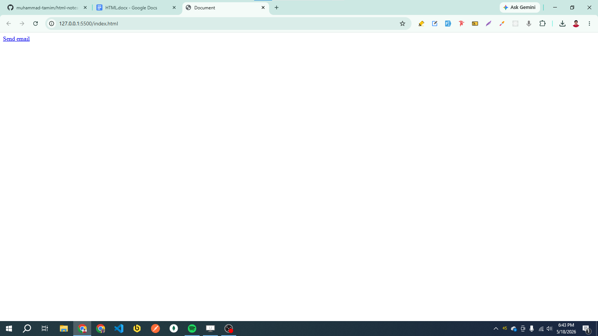

## Anchor Tag with Download Attribute
The HTML `<a>` element’s download attribute allows you to specify that the target file should downloaded. This download is particularly useful for offering user the option to download a file (like a PDF, Image, or document) directly when they click a link.
    
```html
<!DOCTYPE html>
<html lang="en">

<head>
    <meta charset="UTF-8">
    <meta name="viewport" content="width=device-width, initial-scale=1.0">
    <title>Document</title>
</head>

<body>
    <a href="assets/images/html-heading/html-heading.png" download>Download</a>
</body>

</html>
```    

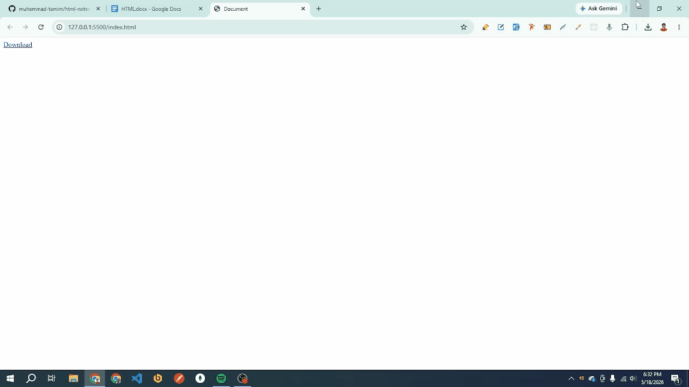

Note: We can specify the name of the downloaded file by providing a value for the download attribute:
- `<a href="assets/al-jazeera.png" download="DownloadFileName">Download</a>`


# HTML Images: 
The HTML `` tag is used to embed an image in a web page. The `` tag has some attributes: src (source), alt (alternative text), width, height etc.  

```html
<!DOCTYPE html>
<html lang="en">

<head>
    <meta charset="UTF-8">
    <meta name="viewport" content="width=device-width, initial-scale=1.0">
    <title>Document</title>
</head>

<body>
    
    
</body>

</html>
```

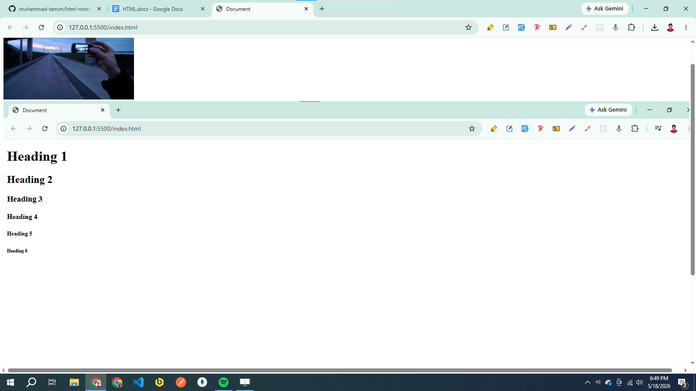


# HTML Tables:

```html
<!DOCTYPE html>
<html lang="en">

<head>
    <meta charset="UTF-8">
    <meta name="viewport" content="width=device-width, initial-scale=1.0">
    <title>Document</title>
</head>

<body>
    <table>
        <caption>Table Data</caption>
        <tr>
            <th>Company</th>
            <th>Contact</th>
            <th>Country</th>
        </tr>
        <tr>
            <td>Meta</td>
            <td>Mark Zukerbarg</td>
            <td>America</td>
        </tr>
        <tr>
            <td>google</td>
            <td>Lere page</td>
            <td>America</td>
        </tr>
    </table>

</body>

</html>
```

here: 
- `<table>` = defines a table
- `<tr>` = defines a table row
- `<th>` = defines a table header
- `<td>` = defines a table data or cell
- `<caption>` = Serves as a heading for the entire table


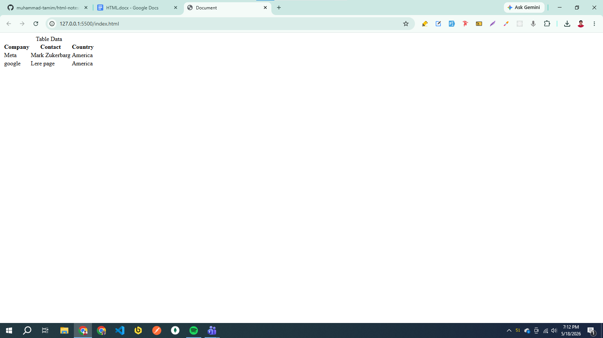

# HTML Lists:

There are two types of lists in HTML:
- Unordered List
- Ordered List

## Unordered List:
An unordered list starts with the `<ul>` tag. Each list starts with the `<li>` tag. We can customize the markers for list items using the CSS list-style-type property. it can have one of the following values:
- disc (default)
- circle 
- square
- none

```html
<!DOCTYPE html>
<html lang="en">

<head>
    <meta charset="UTF-8">
    <meta name="viewport" content="width=device-width, initial-scale=1.0">
    <title>Document</title>
</head>

<body>
    <ul>
        <li>Coffee</li>
        <li>Tea</li>
        <li>Milk</li>
    </ul>
    <ul style="list-style-type: circle;">
        <li>Coffee</li>
        <li>Tea</li>
        <li>Milk</li>
    </ul>
    <ul style="list-style-type: square;">
        <li>Coffee</li>
        <li>Tea</li>
        <li>Milk</li>
    </ul>
    <ul style="list-style-type: none;">
        <li>Coffee</li>
        <li>Tea</li>
        <li>Milk</li>
    </ul>
</body>

</html>
```

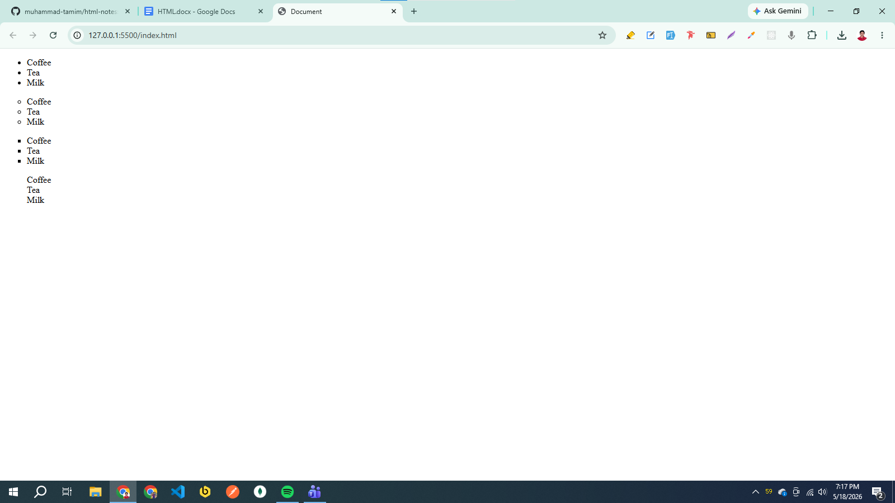

**Note:** We can further customize list markers using the CSS list-style-image property. This allows us to replace the default marker with an image.

```html
<ul style="list-style-image: url('image-name.png')">
  <li>Coffee</li>
  <li>Tea</li>
  <li>Coca Cola</li>
</ul>
```

## Ordered List:
An ordered list starts with the `<ol>` tag. Each list item stars with the `<li>` tag. With the help of type attribute, it has one of the following values:
- type = “1” (default)
- type = “A”
- type = “a”
- type = “I”
- type = “i”

```html
<!DOCTYPE html>
<html lang="en">

<head>
    <meta charset="UTF-8">
    <meta name="viewport" content="width=device-width, initial-scale=1.0">
    <title>Document</title>
</head>

<body>
    <ol>
        <li>Coffee</li>
        <li>Tea</li>
        <li>Milk</li>
    </ol>
    <ol type="A">
        <li>Coffee</li>
        <li>Tea</li>
        <li>Milk</li>
    </ol>
    <ol type="a">
        <li>Coffee</li>
        <li>Tea</li>
        <li>Milk</li>
    </ol>
    <ol type="I">
        <li>Coffee</li>
        <li>Tea</li>
        <li>Milk</li>
    </ol>
    <ol type="i">
        <li>Coffee</li>
        <li>Tea</li>
        <li>Milk</li>
    </ol>

</body>

</html>
```

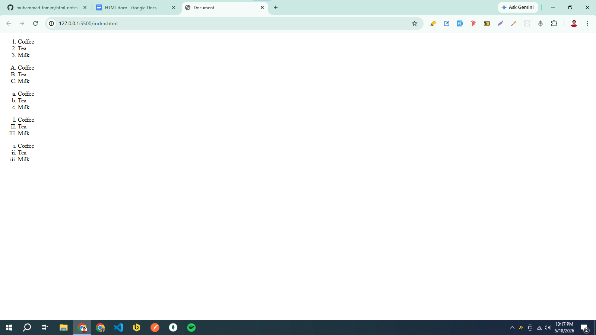

**Note:** By default, an ordered list will start counting form 1. If we want to start counting form a specified number, we can use the start attribute:

```html
<!DOCTYPE html>
<html lang="en">

<head>
    <meta charset="UTF-8">
    <meta name="viewport" content="width=device-width, initial-scale=1.0">
    <title>Document</title>
</head>

<body>
    <ol start="50">
        <li>Coffee</li>
        <li>Tea</li>
        <li>Milk</li>
    </ol>
</body>

</html>
```

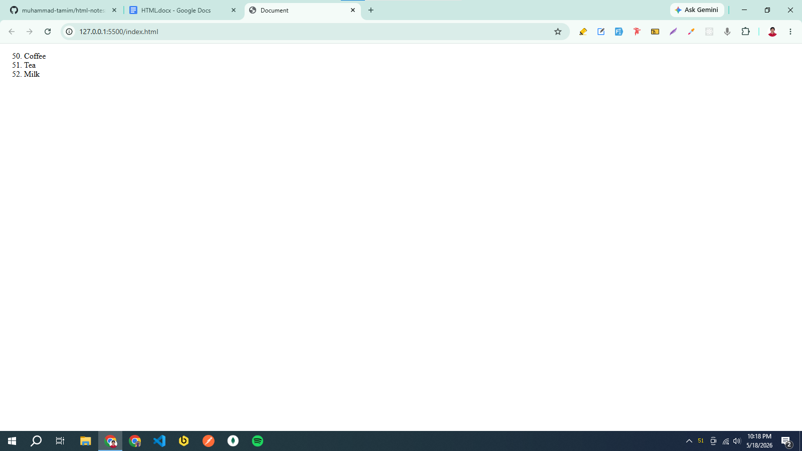

# HTML Block and Inline Elements:
Every HTML element has a default display value, depending on what type of element it is. The two most common display values are block and inline.

## Block Elements
A block element always stars on a new line and takes up the full width available (stretches out to left and right as far as it can) also the browsers automatically add some space (a margin) before and after the element. 

Here are some common block-level elements in HTML:
```html
<div>, <footer>, <form>, <h1>-<h6>, <p>, <header>, <ol>, <ul>,  <li>, <main>, <nav>, <section>, <table>
```

## Inline Elements
An inline element does not start on a new line and only takes up as much width as necessary. 

Here are some common inline elements in HTML:
```html
<a>, <br>, <button>, , <input>, <label>, <select>, <small>, <span>, <strong>, <sub>, <sup>, <textarea>
```

## Div Element:
The `<div>` element is a block element that is used as a container for other HTML elements.

```html
<!DOCTYPE html>
<html lang="en">

<head>
    <meta charset="UTF-8">
    <meta name="viewport" content="width=device-width, initial-scale=1.0">
    <title>Document</title>
</head>

<body>
    <div>
        <h2>London</h2>
        <p>London is the capital city of England.</p>
        <p>London has over 9 million inhabitants.</p>
    </div>

    <div>
        <h2>Oslo</h2>
        <p>Oslo is the capital city of Norway.</p>
        <p>Oslo has over 700,000 inhabitants.</p>
    </div>

    <div>
        <h2>Rome</h2>
        <p>Rome is the capital city of Italy.</p>
        <p>Rome has over 4 million inhabitants.</p>
    </div>

</body>

</html>
```

## Span Element:
The `<span>` element is an inline element that is used as an inline container to style small parts of text.

```html
<!DOCTYPE html>
<html lang="en">

<head>
    <meta charset="UTF-8">
    <meta name="viewport" content="width=device-width, initial-scale=1.0">
    <title>Document</title>
</head>

<body>
    <p> This is a <span style="color: red;">highlighted</span> word in the sentence. </p>
</body>

</html>
```


# HTML Class and ID Attribute:

## HTML Class Attribute:
The HTML class attribute is used to specify a class for an HTML element. Multiple HTLM elements can share the same class.

```html
<!DOCTYPE html>
<html lang="en">

<head>
    <meta charset="UTF-8">
    <meta name="viewport" content="width=device-width, initial-scale=1.0">
    <title>Document</title>

    <style>
        .city {
            background-color: tomato;
            color: white;
            margin: 20px;
            padding: 20px;
        }
    </style>
</head>

<body>
    <div class="city">
        <h2>London</h2>
        <p>London is the capital of England.</p>
    </div>

    <div class="city">
        <h2>Paris</h2>
        <p>Paris is the capital of France.</p>
    </div>
</body>

</html>
```

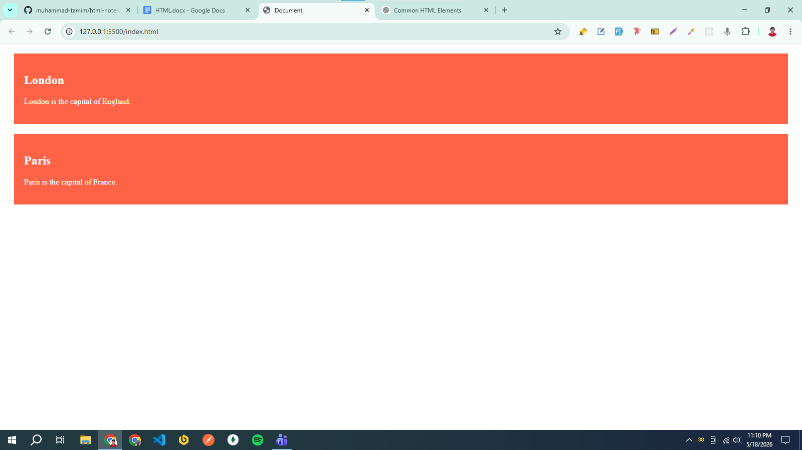

**Note:**  HTML elements can belong to more than one class. To define multiple classes, separate the class name with a space:

```html
<!DOCTYPE html>
<html lang="en">

<head>
    <meta charset="UTF-8">
    <meta name="viewport" content="width=device-width, initial-scale=1.0">
    <title>Document</title>

    <style>
        .city {
            background-color: tomato;
            color: white;
            padding: 10px;
        }

        .main {
            text-align: center;
        }
    </style>
</head>

<body>
    <h2 class="city main">London</h2>
    <h2 class="city">Paris</h2>
    <h2 class="city">Tokyo</h2>
</body>

</html>
```

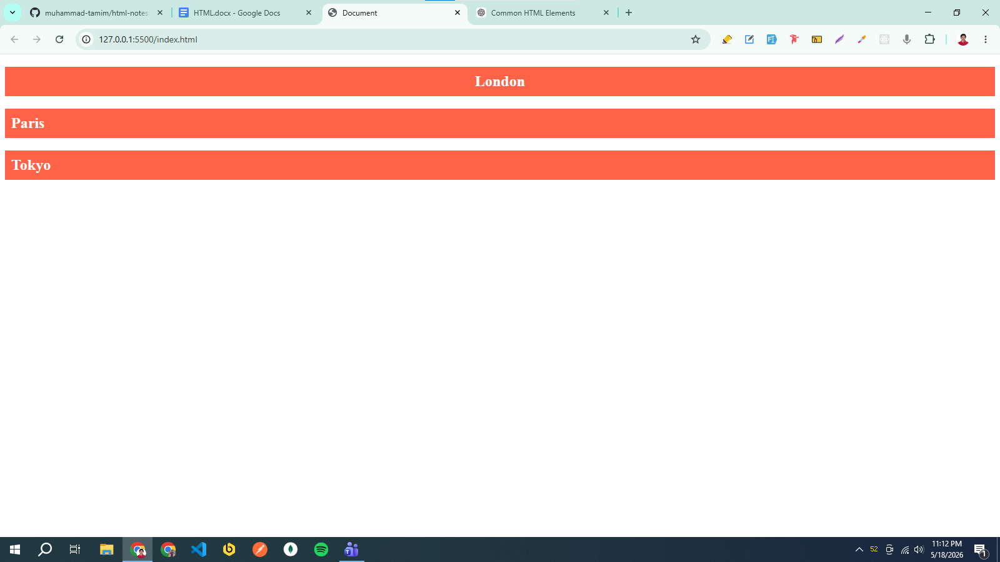

## HTML id Attribute:
The HTML id attribute is used to specify a unique id for an HTML element. You cannot have more than one element with the same id in an HTML document.

```html
<!DOCTYPE html>
<html lang="en">

<head>
    <meta charset="UTF-8">
    <meta name="viewport" content="width=device-width, initial-scale=1.0">
    <title>Document</title>

    <style>
        #city {
            background-color: tomato;
            color: white;
            margin: 20px;
            padding: 20px;
        }
    </style>
</head>

<body>
    <h2 id="city">London</h2>
</body>

</html>
```

## Difference Between class and id: 

| class                      | id                          |
| -------------------------- | --------------------------- |
| Used for multiple elements | Used for one unique element |
| Starts with `.` in CSS     | Starts with `#` in CSS      |
| Can be reused              | Must be unique              |

# HTML Semantic Elements:
Semantic elements means Elements with a meaning. It clearly describes its meaning to both the browser and the developer. HTML has several semantic elements that define the different parts of a web page:
- <header> = Defines a header for a document or a section
- <nav> = Defines a set of navigation links
- <section> = Defines a section in a document
- <aside> = Defines content aside from the content (like a sidebar) 
- <footer> = Defines a footer for a document or a section

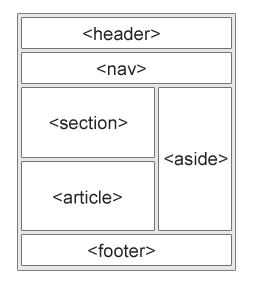

# HTML Forms

## HTML Form Elements

## HTML Input Types

## HTML Input Attributes

# HTML Video

## The HTML `<video>` Element

## Autoplay Attribute

# HTML Audio

## The HTML `<audio>` Element

## Autoplay Attribute

# HTML YouTube Videos

## Playing a YouTube Video in HTML

## YouTube Autoplay + Mute

## YouTube Loop